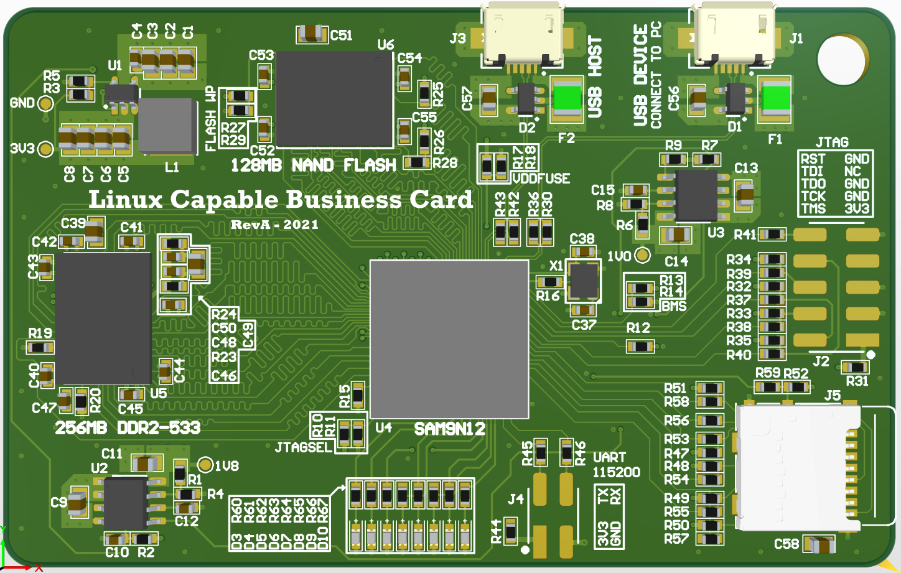
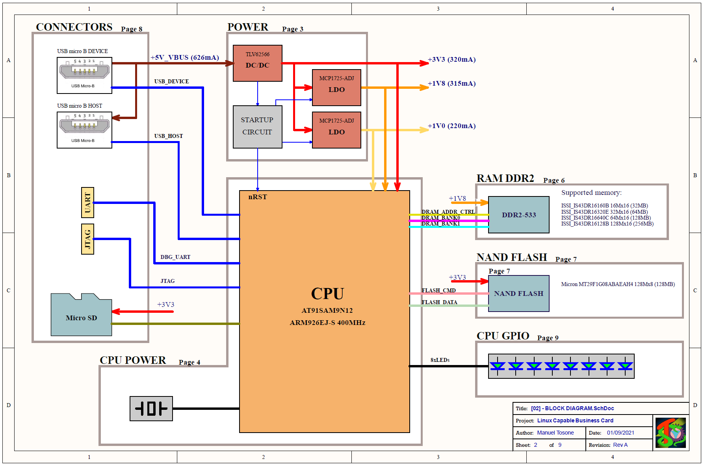

# Linux Capable business Card

<!-- TABLE OF CONTENTS -->

  
Table of Contents

  <ol>
    <li><a href="#about-the-project">About The Project</a></li>
    <li><a href="#block-diagram">Block Diagram</a></li>
    <li><a href="#getting-started">Block Diagram</a></li>
  </ol>

<!-- ABOUT THE PROJECT -->
## About The Project
Business card sized computer capable of running Linux.

- Microchip AT91SAM9N12 microprocessor, ARM926 core running at 400MHz
- 256MB RAM DDR2-533
- 128MB of NAND FLASH
- micro SD-Card slot
- 8x LEDs

For more info check out the [project on hackaday.io](https://hackaday.io/project/181259-linux-capable-business-card)

<!-- BLOCK DIAGRAM -->
## Block Diagram

<!-- GETTING STARTED -->
## Getting Started
### Getting the code
    git clone --recursive https://github.com/ts-manuel/Linux-Capable-Business-Card.git

### Compinig
    cd linux
    ./setup.sh
    ./build_sd_linux_dt.sh

### Buildroot Folder Structure
- buildroot/output/build/     where pakages are downloaded and builded
- buildroot/output/images/    where images are copied after building